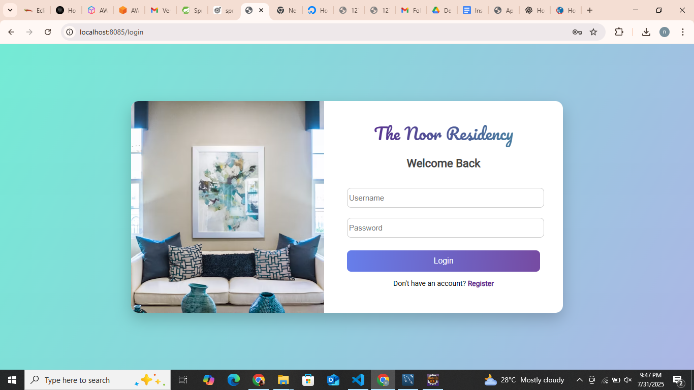
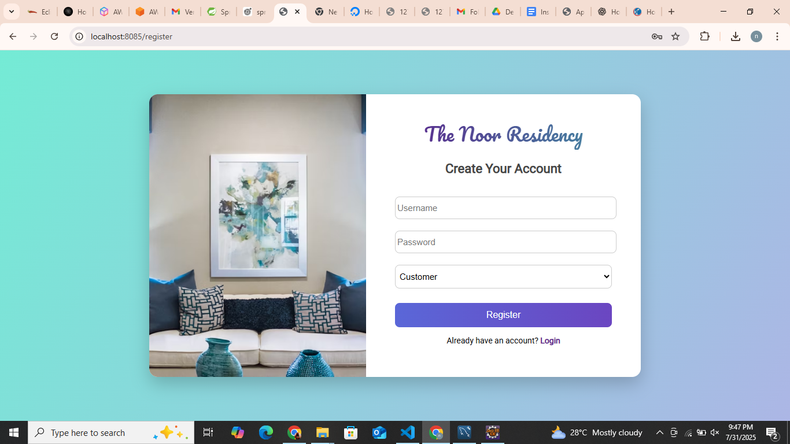
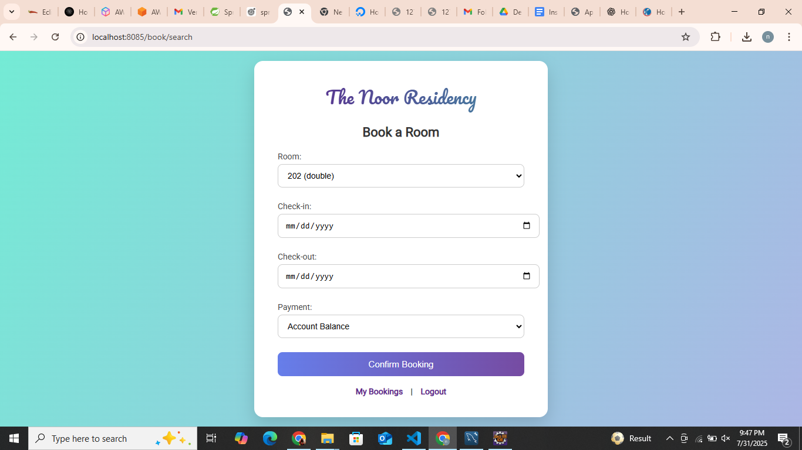
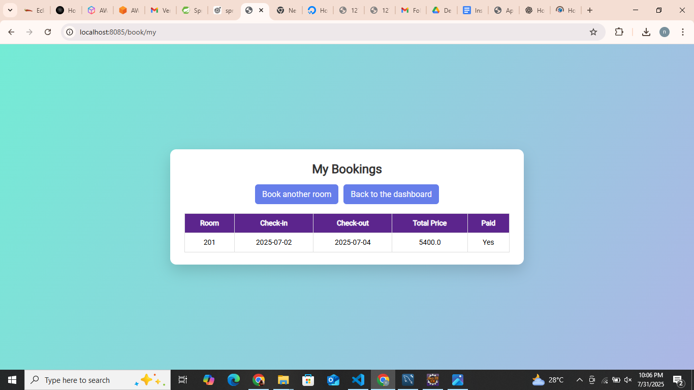
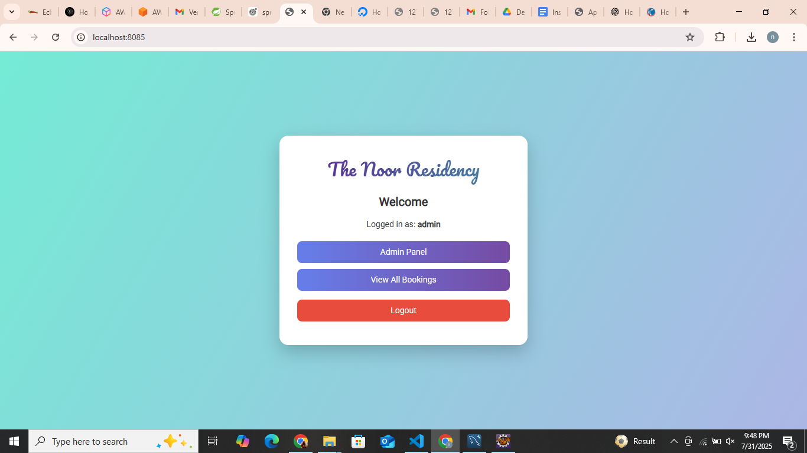
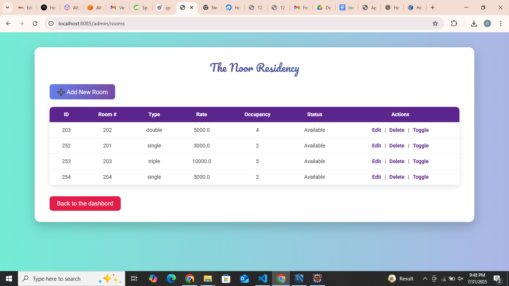
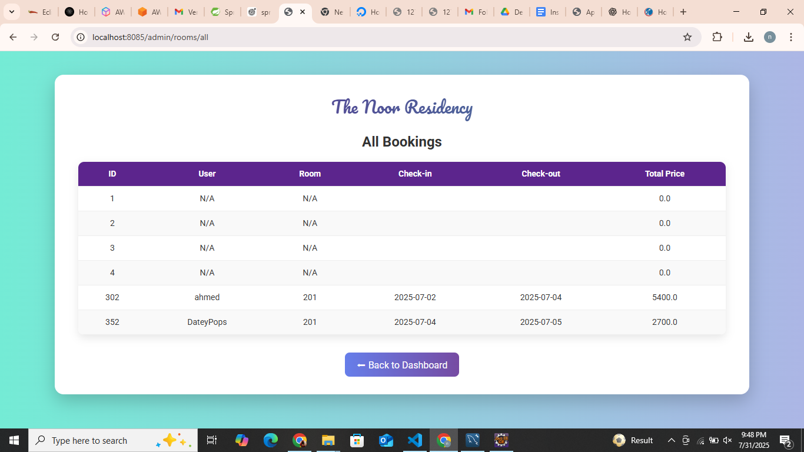
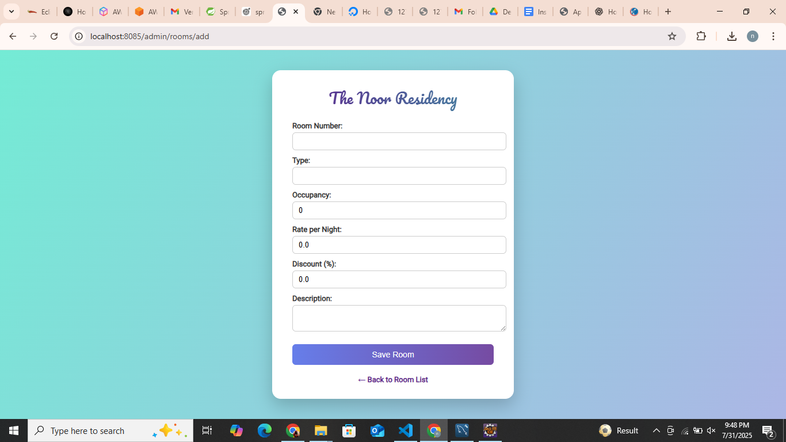

# 🏨 The Noor Residency

**The Noor Residency ** is a ** Hotel Management System ** built using ** Spring Boot + Thymeleaf + MySQL **.
This project provides complete functionality for **room booking, an admin panel, and a user dashboard**.

---

## 🚀 Features

### **User (Customer)**
- Register & Login (Spring Security based authentication)
- Available rooms browse & book karna
- Multiple **payment methods** (Account Balance / Card)
- View & manage **My Bookings**
- Automatic account balance deduction on booking

### **Admin**
- Admin Dashboard
- **Manage Rooms** (Add / Edit / Delete / Toggle Availability)
- **View All Bookings** with user details
- Restrict room deletion if active bookings exist

---

## 🛠 Tech Stack

- **Backend:** Spring Boot 3.x
- **Frontend:** Thymeleaf, HTML5, CSS3
- **Database:** MySQL with JPA/Hibernate
- **Security:** Spring Security (Role-based access)
- **Build Tool:** Maven
- **Java Version:** 21

---

## 📂 Project Structure

```
TheNoorResidency/
├── src/main/java/com/noor/the_noor_residency/
│   ├── controller/        # Web Controllers (Admin, Booking, Auth)
│   ├── entity/            # JPA Entities (User, Room, Booking)
│   ├── repository/        # Spring Data JPA Repositories
│   ├── service/           # Business Logic & Booking Handling
│   └── TheNoorResidencyApplication.java
│
├── src/main/resources/
│   ├── templates/
│   │   ├── admin/         # Admin Pages (rooms.html, all-bookings.html, etc.)
│   │   ├── booking/       # Booking Pages (search.html, my-bookings.html)
│   │   ├── login.html
│   │   ├── register.html
│   │   └── home.html
│   ├── static/            # CSS, JS, Images
│   └── application.properties
│
└── pom.xml
```

---

## ⚙️ Installation & Setup

### **1️⃣ Clone the Repository**
```bash
git clone https://github.com/NoorAhmed786/TheNoorResidency.git
cd TheNoorResidency
```

### **2️⃣ Configure MySQL Database**
- Create database:
```sql
CREATE DATABASE noor_residency;
```
- Update `src/main/resources/application.properties`:
```properties
spring.datasource.url=jdbc:mysql://localhost:3306/noor_residency
spring.datasource.username=root
spring.datasource.password=yourpassword

spring.jpa.hibernate.ddl-auto=update
spring.jpa.show-sql=true
```

---

### **3️⃣ Run the Project**
```bash
mvn spring-boot:run
```
- Open in browser: **`http://localhost:8085`**

---

## 🔑 Default Admin User
| Username | Password  | Role   |
|----------|----------|--------|
| admin    | admin123 | ADMIN  |

---
## Common Bugs that I faced during Project
** template not found → wrong return view name / wrong folder (booking/search.html). **

**Field 'id' doesn't have a default value → add @GeneratedValue strategy/sequences OK.**

**typeMismatch int/double → change ratePerNight to double. **

**NPE getUser() → booking create karte waqt setUser(user) zaroori. **

**Delete room FK error → guard ya cascade. **

**Thymeleaf parse error → malformed HTML (duplicate DOCTYPE inside code file). **

## 📸 Screenshots

> Add screenshots of your pages here:

- Login Page  

**Login**


**Register**


**UserDashboard**




**AdminDashboard**






---
